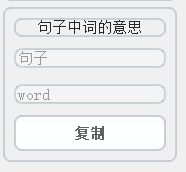

## QuickPrompt 

这个项目主要是在使用AI学习英文的过程中，渐渐的我有一些固定的提示词模板。但是每次复制粘贴有太麻烦，所以我就写了这个小工具来让整个过程更加便利。

## 模板语法

这个小工具可以根据配置为每一段模板生成一个小面板供你使用。

**配置文件**为程序所以在目录下的configure.prompt文件，是一个文本文件，你可以使用任何文本编辑器打开并开始编辑你的模板。但是一定要注意的是，字符编码一定要选择**UTF-8**。

每段模板提示词由**独占一行**的ELEMENT_BEGIN <title>开头，独占一行的ELEMENT_END结尾。中间若干行就是你的提示词模板。例如：

```
ELEMENT_BEGIN 单词学习
依据dictionary.cambridge.org/zhs/，给出\_oOS_word_EOo\_ 的原型，词性，词形，用法
ELEMENT_END
```

ELEMENT_BEGIN <title>中的title对应着小窗口的标题，可以提示你这段提示词是干什么用的。

提示词模板中可以使用\_oOS_name_EOo_ 来进行占位，中间name可以自己更换，每一个不同name都会在小空间中生成一个可输入的位置。name也会显示在其中。比如：

```txt
ELEMENT_BEGIN 句子中词的意思
依据dictionary.cambridge.org，给出 _oOS_句子_EOo_ 的翻译，
并分析_oOS_句子_EOo_中的 _oOS_word_EOo_ 的意思。
ELEMENT_END
```

对应的小窗口样式就是



可以看到，两个\_oOS\_句子\_EOo\_ 生成了一个输入空间。

在doc中有一个示例模板文件。


程序的qss文件是从[GTRONICK/QSS: QT Style Sheets templates (github.com)](https://github.com/GTRONICK/QSS)复制并修改的。

程序logo是使用网络服务www.designevo.com制作的。

非常感谢！